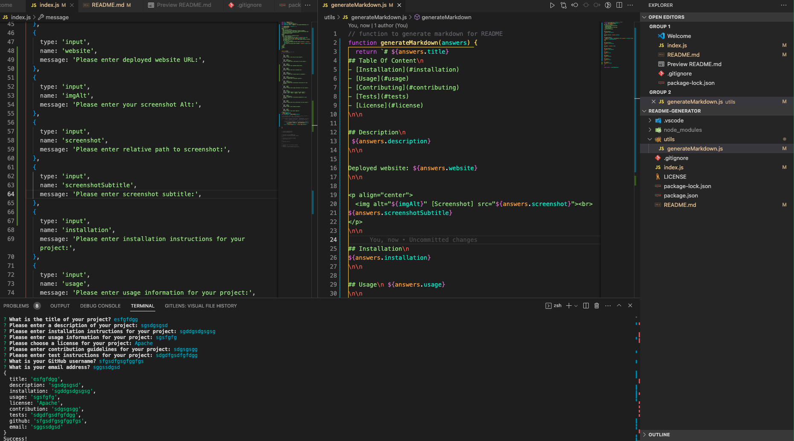

# Readme Generator

## Table Of Content

- [Description](#description)
- [Deployed website link](#website)
- [Installation](#installation)
- [Usage](#usage)
- [Contributing](#contribution)
- [Tests](#tests)
- [GitHub](#github)
- [Contact](#contact)
- [License](#license)

## Description

THis is the description

Deployed website: www.antonscheving.com

   
Screenshot subtitle

## Installation

this is how you install it

Readme Generator is built with the following tools and libraries: <html><ul><li>First item</li> <li>Second item</li> <li>Third item</li><ul><html>

## Usage
 
This is how you use it

## Contribution
 
Please contribute this way

## Tests
 
please test in this way

## GitHub

https://github.com/AntonScheving

Visit my website: <strong><a href="www.antonscheving.com">AntonScheving.com</a></strong>

## Contact

Feel free to reach out to me on my email:
anton@scheving.email

## License

