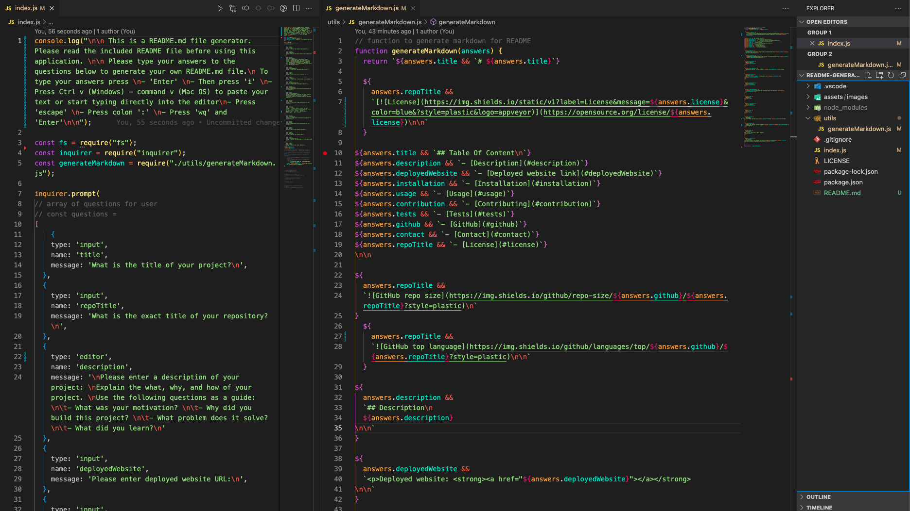

# README Generator

  [](https://opensource.org/license/MIT)


## Table Of Content

- [Description](#description)

- [Installation](#installation)
- [Usage](#usage)
- [Contributing](#contribution)
- [Tests](#tests)
- [GitHub](#github)
- [Contact](#contact)
- [License](#license)


  


## Description
Click here to watch the 
<a href="https://youtu.be/9iVQFaRaNV8"><strong>README Generator video demo</a></strong>

  The README Generator project is a command-line tool that automatically generates a README.md file for a project based on user input. The tool is written in JavaScript and prompts the user with questions about the project, such as the project title, description, installation instructions, usage instructions, contribution guidelines, and more.

The motivation behind creating this project was to provide a solution to the problem of developers spending countless hours creating a README file for their project. Creating a well-documented README file is essential for showcasing a project and making it accessible to other developers. However, the process of creating one from scratch can be time-consuming and tedious. This tool streamlines the process and saves developers time and effort.

The project solves the problem of creating a professional-looking and well-documented README.md file for a project. The tool ensures that all the necessary sections are included and formatted correctly, and it almost eliminates the need for manual formatting and editing.

Through this project, I learned how to use Node.js to build a command-line application, how to prompt users with questions and store their responses, and how to dynamically generate a Markdown file. I also gained experience in working with Git and GitHub for version control.


<p align="center">
  <br>
README Generator code screenshot
</p>


## Installation

To install and use the README Generator, follow these step-by-step instructions:

1. Clone the GitHub repository: Start by cloning the GitHub repository to your local machine using the command:

```jsx

git clone https://github.com/AntonScheving/README-Generator.git
```

1. Install Node.js: If you don't have Node.js installed on your machine, download and install it from the official website: **[https://nodejs.org/en/](https://nodejs.org/en/)**.
2. Install dependencies: Navigate to the project directory in your terminal and run the following command to install the required dependencies:

```jsx

npm install --save inquirer fs
```

1. Run the generator: To run the README Generator, run the following command in your terminal:

```jsx

node index.js
```

1. Answer the prompts in the terminal: The generator will prompt you with a series of questions about your project. Answer each question as accurately as possible. See the Usage section to learn how to answer longform questions.
2. Generate README.md file: Once you have answered all the questions, the generator will generate the **`README.md`** file based on your answers. The generated file will be saved in the project directory.
3. Review and edit the generated **`README.md`** file: Review the generated **`README.md`** file and make any necessary edits or additions to ensure that it accurately represents your project and provides all the necessary information.

That's it! With these steps, you can generate a professional-looking **`README.md`** file for your project with minimal effort.


README Generator is built with the following tools and libraries: <ul><li>First item</li> <li>Second item</li> <li>Third item</li></ul>


## Usage
 
Here are step-by-step instructions for using the README Generator:

1. Open your terminal and navigate to the directory where the generator files are located.
2. Run the command "node index.js" to start the generator.
3. The generator will prompt you with a series of questions about your project, such as the project title, description, installation instructions, usage instructions, contribution guidelines, and more.
4. This application uses the default text editor for most of the answers. In VS Code the default text editor is Vim. Please follow these instructions to use the Vim editor: 
- To type your answer you are prompted to press  'Enter' to start using the editor
- Then press 'i' to launch the editor interface
- Start typing your answer or paste your answer with Ctrl v (Windows) or command v (Mac OS)
- When you are done typing your answer press 'escape'
- Press colon ‘:wq’ and enter to save and exit the editor to get to the next question
1. The generator will store your responses in an object.
2. Once you've answered all the questions, the generator will use that object to dynamically generate the README.md file.
3. The generated README.md file will be located in the same directory as the generator files. Each generated file will override the previous file generated.
4. Copy your generated [README.md](http://README.md) file and paste it into your own project folder.


## Contribution
 
Thank you for considering contributing to this project! Please read the **[Contributor Covenant](https://www.contributor-covenant.org/)** before submitting any contributions.

### **Types of Contributions**

We welcome contributions in the form of bug reports, feature requests, code contributions, and documentation improvements.

### **How to Contribute**

1. Fork the repository and create a new branch.
2. Make your changes and ensure that they are well-documented and tested.
3. Submit a pull request to the main repository and include a detailed description of your changes.

### **Code of Conduct**

We expect all contributors to adhere to the **[Contributor Covenant](https://www.contributor-covenant.org/)**. Please be respectful and inclusive in your contributions and interactions with others.


## Tests
 
After the README Generator has generated the README.md file based on your input, it is important to test the file to ensure that it contains all the necessary sections and information, and that the formatting is correct. 


## GitHub

<a href="https://github.com/AntonScheving"><strong>AntonScheving</a></strong>


<p>Visit my website: <strong><a href="www.antonscheving.com">AntonScheving.com</a></strong></p>


## Contact

Feel free to reach out to me on my email:
anton@scheving.email


## License

[](https://opensource.org/license/MIT)


